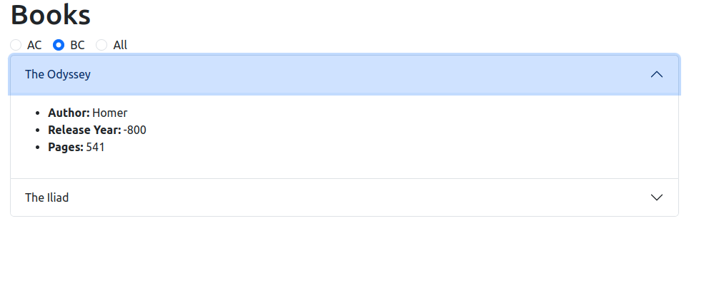

# React ⚛️

## Tasks

### Displaying data in React

1. Set up the project.
2. Use a CSS framework (for example Bootstrap/React Bootstrap/Reactstrap/MaterialUI) or Tailwind CSS for the implementation.
3. The page have a title in a H1 tag: "Books".
4. Use an "accordion" to display all Book titles as the accordion's title.
5. If the user clicks on a title, the accordion opens, the other details of the book become visible in the accordion body in an unorered list. You can use a states to manage this, but the you can also rely on the choose framework's behaviour.
6. Only one book's detail can be open at once.

### Interactions in React

1. Add three radio button inputs with three labels (BC (Before Chirst), AC (After Chirst), All) between the page title and the Accordion.  
2. Only one radio button can be selected at once (so they are controlling the same value). 
3. If the user clicks on a label it should also select the radio button. (The label is correctly connected to the radio input).
4. When the user selects "BC", the list only show the books where the release year is less or equal than zero. If the user selects the "AC" option, it should show only the book titles when the release year is greater than zero. If all is selected, all items should be displayed again.

Here is a screenshot of the application, using React Bootstrap. It is just an illustrative example, that helps you understand the task. You do not have to follow it pixel by pixel.

## Setup the project

Fill the db.json and db.original.json according to the [JSON Server doc](https://github.com/typicode/json-server).
Change the urls in the description below.

1. This is a Vite project.
2. Issue `npm install` from **this** folder to install the needed dependencies.
3. Issue `npm run dev` from **this** folder to start the Vite development server.
4. Start the server with the `npm run server` command in a new terminal.
5. Open the [http://localhost:5173](http://localhost:5173) in the browser, it shows the "It Works!" string. 
6. You can test that the server is working by invoking the `http://127.0.0.1:5500/books` endpoint with your favorite REST Client. (You can use the `requests.http` file if you use the [Rest Client VS Code Extension](https://marketplace.visualstudio.com/items?itemName=humao.rest-client)). You should get 200 OK responses.
7. A proxy is configured on the `vite.config.js` file with an `/api` path prefix to redirect any request starting with `/api` to `http://127.0.0.1:5500`. So you can reach the endpoint from Vite's JS code like this ` fetch("/api/books")` --> it will be fetched from [TODO] `http://127.0.0.1:5500/books`.

## Hints

- If you messed up with the database you can copy the `db.original.json` to `db.json` to reset it.
- Do not take care of the `.gitkeep` files. They are needed to keep their parent directories in git.
